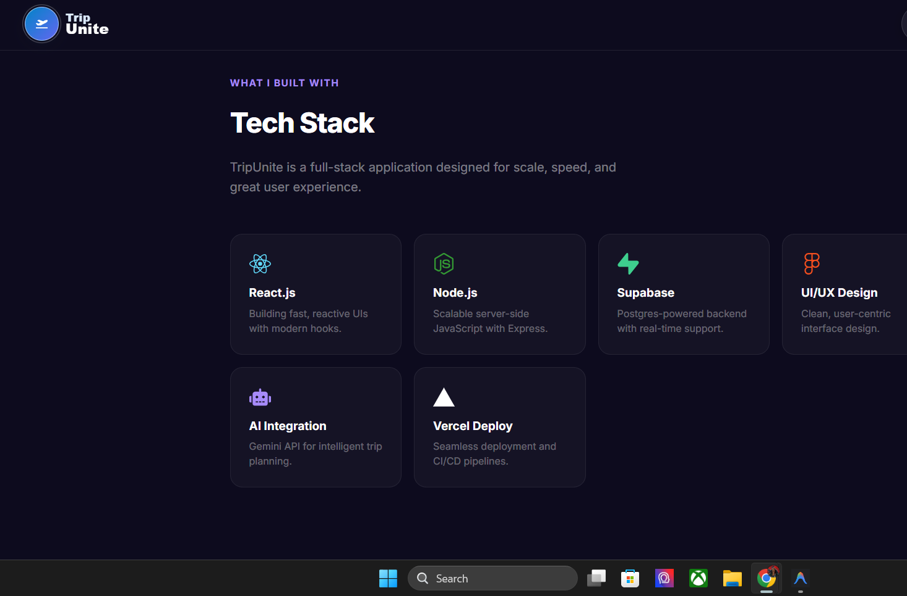
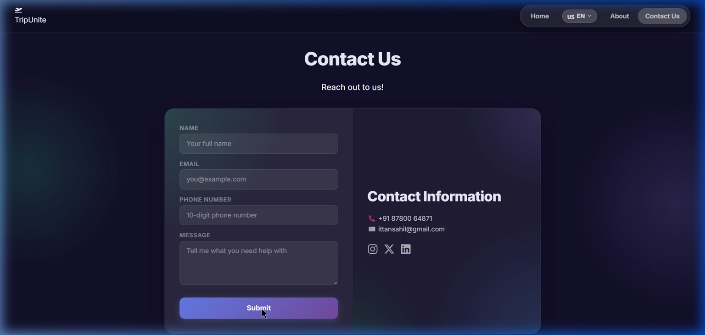
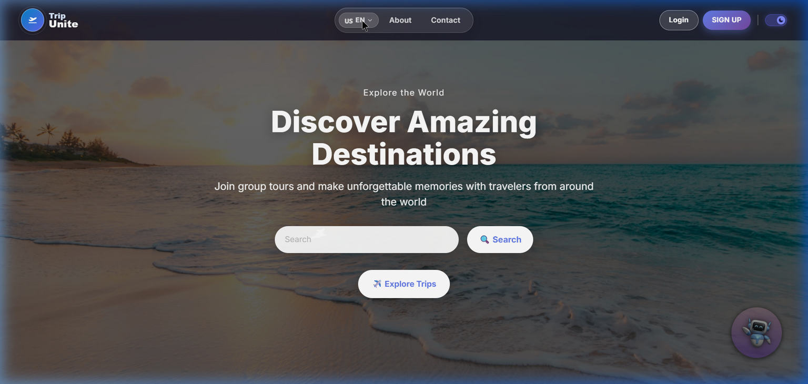

# TripUnite

TripUnite is a full-stack travel companion platform for people who want to discover destinations, create group trips, join travel plans, and manage travel communities from one place. The project includes a React frontend, a Node.js/Express backend, Supabase database integration, JWT authentication, trip dashboards, join-request workflows, user feedback, language selection, theme switching, and an AI chatbot for travel planning support.

The repository is organized as a practical full-stack application: the frontend focuses on the user journey and visual experience, while the backend handles authentication, trip data, feedback, chatbot requests, and Supabase communication.

## Repository

- GitHub: `https://github.com/uvtripathi/Trip-Unite`
- Author: Yuvraj Tripathi
- License: MIT

## Core Idea

Planning a trip is easier when travelers can find the right people to go with. TripUnite is built around that idea. A user can sign up, browse travel opportunities, create a new trip, request to join an existing trip, manage their own dashboard, and use the chatbot when they need travel suggestions or planning help.

## Main Features

- User signup, login, logout, and protected sessions
- JWT-based authentication stored through secure cookies
- Create trips with destination, dates, budget, age range, local guide preference, meetup location, and remarks
- Browse all available trips
- Join a trip by submitting traveler details
- Dashboard for viewing user-created trips
- Joined trips section for trips requested or joined by the logged-in user
- Trip member approval flow with pending, approved, and rejected statuses
- Feedback form with rating support
- Contact page and presentation/showcase page
- AI chatbot endpoint powered by Google Generative AI
- Supabase schema for users, trips, trip members, feedback, and monthly trip statistics
- Light/dark theme system with saved preference
- Language selection using `i18next` and `react-i18next`
- Lazy-loaded frontend routes with route loading UI
- Screenshot gallery for GitHub presentation

## Screenshots

| Explore | Feedback |
| :---: | :---: |
|  |  |

| Tech Stack |
| :---: |
|  |

| Contact | Dashboard |
| :---: | :---: |
|  |  |

## Tech Stack

### Frontend

- React 18
- React Router DOM
- Redux Toolkit
- Axios
- i18next and react-i18next
- React Icons
- React Slick and Slick Carousel
- React Toastify
- Tailwind CSS
- Custom CSS modules/files for page-specific design
- Create React App build tooling through `react-scripts`

### Backend

- Node.js
- Express.js
- Supabase JavaScript client
- PostgreSQL through Supabase
- JSON Web Tokens
- Bcrypt password hashing
- Cookie Parser
- CORS
- Express Rate Limit
- Express Validator
- Zod validation
- Google Generative AI SDK
- Nodemon for development

## Project Structure

```text
TripUnite/
├── back-end/
│   ├── api/
│   │   └── index.js
│   ├── authN/
│   │   └── tripsType.js
│   ├── controllers/
│   │   ├── authController.js
│   │   ├── chatBot.controller.js
│   │   ├── dashboardController.js
│   │   ├── feedbackController.js
│   │   ├── joinedTripsController.js
│   │   ├── tripMembersController.js
│   │   └── userTripController.js
│   ├── db/
│   │   ├── index.js
│   │   ├── supabase.js
│   │   └── supabase-schema.sql
│   ├── middlware/
│   │   └── verifyJwtMiddleware.js
│   ├── routes/
│   │   ├── auth.js
│   │   ├── chatBot.route.js
│   │   └── tripRoute.js
│   ├── scripts/
│   │   └── smokeTest.js
│   ├── utils/
│   │   ├── ApiError.js
│   │   ├── asyncHandler.js
│   │   ├── chatHistory.js
│   │   └── customConsole.js
│   ├── app.js
│   ├── index.js
│   ├── package.json
│   └── vercel.json
├── front-end/
│   ├── public/
│   ├── src/
│   │   ├── Assets/
│   │   ├── components/
│   │   ├── context/
│   │   ├── util/
│   │   ├── App.js
│   │   ├── App.css
│   │   ├── index.js
│   │   └── index.css
│   ├── package.json
│   ├── tailwind.config.js
│   └── vercel.json
├── screenshots/
├── LICENSE
└── README.md
```

## Frontend Walkthrough

The frontend is a React single-page application located in `front-end/`.

### Routes

The main routes are declared in `front-end/src/App.js`:

- `/` renders the landing home page and chatbot
- `/signup` renders the authentication screen
- `/login` renders the authentication screen
- `/main` renders the main explore/travel page
- `/dashboard` renders the user dashboard
- `/create` renders the trip creation flow
- `/join` renders the trip joining flow
- `/about` renders the about/developer section
- `/showcase` renders the product showcase page
- `/contact` renders the contact page

### Important Frontend Components

- `Home.js`: landing page and introductory travel experience
- `Main.js`: main destination/trip discovery area
- `Login.js`: login and signup interface
- `Create.js`: create-trip form
- `JoinTrip.js`: join-trip flow and trip request UI
- `Dashboard.jsx`: user dashboard for created trips and requests
- `Trips.jsx`: trip listing UI
- `Feedback.js`: user feedback and rating form
- `Contact.js`: contact page
- `About.js`: about page and creator/profile presentation
- `Showcase.js`: product showcase page
- `LanguageSelector.jsx`: language switching control
- `ThemeToggle.jsx`: light/dark theme toggle
- `ChatBot.js`: frontend chatbot interface
- `RouteLoader.jsx` and `Spinner.jsx`: loading states
- `BrandLogo.jsx`: reusable brand logo component
- `FlightPath.jsx`: animation component

### Frontend Assets

The app includes destination and visual assets under `front-end/src/Assets/`, including:

- Kashmir, Kerala, Agra, Jaipur, and Mumbai destination images
- Home page background images
- Login background image
- Logo assets
- About/profile images
- Animated travel GIF

### Frontend Utilities

- `front-end/src/util/api.js`: central API URL helper
- `front-end/src/util/i18n.js`: language and translation setup
- `front-end/src/context/userContext.jsx`: user context for frontend state

## Backend Walkthrough

The backend is an Express API located in `back-end/`.

### Server Setup

- `back-end/index.js`: starts the server
- `back-end/app.js`: configures Express, CORS, cookies, rate limiting, JSON parsing, health routes, chatbot routes, and auth routes
- `back-end/api/index.js`: serverless entry point support

### API Routes

#### Base Routes

- `GET /`: basic home/test route
- `GET /health`: health check route

#### Auth and Trip Routes

Mounted from `back-end/routes/auth.js`:

- `POST /api/auth/register`: register a new user
- `POST /api/auth/login`: log in a user
- `POST /api/auth/logout`: log out a user
- `POST /api/auth/createTrips`: create a new trip
- `POST /api/auth/joinTrips/:trip_id`: request to join a trip
- `POST /api/auth/createFeedback`: submit feedback
- `GET /api/auth/joinedTrips`: get trips joined by the logged-in user
- `GET /api/auth/allTrips`: get all listed trips
- `GET /api/auth/userTrips`: get trips created by the logged-in user
- `GET /api/auth/trips/:trip_id`: get one trip by ID
- `GET /api/auth/tripMembers/:trip_id`: get members/requests for a trip
- `PATCH /api/auth/tripMembers/:member_id/status`: approve or reject a trip member request

#### Chatbot Route

Mounted from `back-end/routes/chatBot.route.js`:

- `POST /api/v1/chatbot`: send a travel-planning message to the AI chatbot

### Backend Controllers

- `authController.js`: user registration, login, logout, trip joining, and trip lookup logic
- `userTripController.js`: trip creation logic
- `dashboardController.js`: user dashboard trip data
- `joinedTripsController.js`: joined trip retrieval
- `tripMembersController.js`: member request listing and approval status updates
- `feedbackController.js`: feedback submission
- `chatBot.controller.js`: Gemini/Google Generative AI chatbot handling

### Middleware and Utilities

- `verifyJwtMiddleware.js`: validates JWT and protects private routes
- `ApiError.js`: API error helper
- `asyncHandler.js`: async route wrapper helper
- `chatHistory.js`: chatbot context/history helper
- `customConsole.js`: custom logging helper

## Database

TripUnite uses Supabase as the database layer. The schema is included at:

```text
back-end/db/supabase-schema.sql
```

The schema creates and configures:

- `users`: registered users, password hashes, roles, and access tokens
- `trips`: trip details such as name, destination, description, dates, budget, age range, and creator
- `trip_members`: join requests and member approval status
- `feedback`: user feedback messages and ratings
- `monthly_trip_stats`: view for monthly trip and join-request metrics
- indexes for better lookup performance
- update triggers for `updated_at` fields
- row-level security baseline

Run the SQL file in the Supabase SQL Editor before using the backend with a fresh Supabase project.

## Environment Variables

Real `.env` files are intentionally ignored. Use the included templates:

- `back-end/.env.example`
- `front-end/.env.example`

### Backend `.env`

```env
PORT=8000
jwt_secret=your_jwt_secret
GEMINI_API_KEY=your_gemini_api_key
CORS_ORIGIN=http://localhost:3000
SUPABASE_URL=https://your-project.supabase.co
SUPABASE_SERVICE_ROLE_KEY=your_service_role_key
```

### Frontend `.env`

```env
REACT_APP_API_BASE_URL=http://localhost:8000
REACT_APP_SUPABASE_URL=https://your-project.supabase.co
REACT_APP_SUPABASE_ANON_KEY=your_anon_key
```

## Local Development

### Prerequisites

- Node.js 20.x recommended for the backend
- npm
- Supabase project
- Gemini API key

### Clone

```bash
git clone https://github.com/uvtripathi/Trip-Unite.git
cd Trip-Unite
```

### Install Backend

```bash
cd back-end
npm install
```

### Install Frontend

```bash
cd ../front-end
npm install
```

### Run Backend

```bash
cd back-end
npm run dev
```

Backend default URL:

```text
http://localhost:8000
```

### Run Frontend

```bash
cd front-end
npm start
```

Frontend default URL:

```text
http://localhost:3000
```

## Available Scripts

### Backend Scripts

```bash
npm run dev        # Start backend with nodemon
npm start          # Start backend with node
npm run smoke:test # Run backend smoke test
```

### Frontend Scripts

```bash
npm start          # Start React development server
npm run build      # Create production build
npm test           # Run React tests
npm run dev        # Alias for React development server
```

## Deployment Notes

### Frontend Deployment

The frontend can be deployed to Vercel, Netlify, or any static host.

Recommended settings:

- Root directory: `front-end`
- Build command: `npm run build`
- Output directory: `build`
- Add all required `REACT_APP_*` environment variables

The frontend contains `front-end/vercel.json` for SPA routing support.

### Backend Deployment

The backend can be deployed to Render, Railway, Vercel, or another Node.js host.

Recommended settings:

- Root directory: `back-end`
- Start command: `npm start`
- Add `SUPABASE_URL`, `SUPABASE_SERVICE_ROLE_KEY`, `jwt_secret`, `GEMINI_API_KEY`, and `CORS_ORIGIN`
- Set `CORS_ORIGIN` to the deployed frontend URL

The backend contains `back-end/vercel.json` and `back-end/api/index.js` for Vercel-style serverless deployment support.

## Verification

The repository was checked before upload with:

```bash
# Backend JavaScript syntax check
node --check back-end/**/*.js

# Frontend production build
cd front-end
npm run build
```

Build notes:

- The frontend build completes successfully.
- Existing ESLint warnings remain in a few components, mostly placeholder `href` values, unused variables, and one React hook dependency warning.
- npm reports dependency vulnerabilities from current package versions; these can be handled in a future dependency-maintenance pass.
- The backend package requests Node 20.x; this is the recommended runtime for deployment.

## Security Notes

- Do not commit real `.env` files.
- Use strong JWT secrets in production.
- Keep Supabase service role keys only on the backend.
- Restrict `CORS_ORIGIN` to trusted frontend domains.
- Review dependency audit results before production deployment.
- Keep the Supabase schema and row-level security policies aligned with production requirements.

## License

This project is licensed under the MIT License.

Copyright (c) 2026 Yuvraj Tripathi.

## Author

Built and maintained by [Yuvraj Tripathi](https://github.com/uvtripathi).
